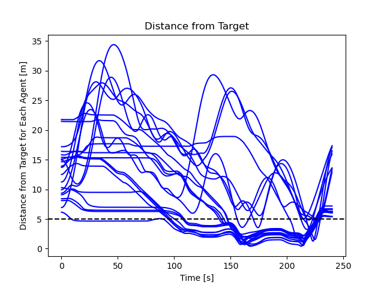
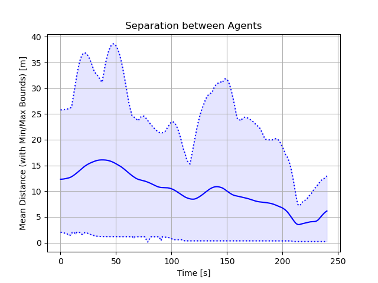
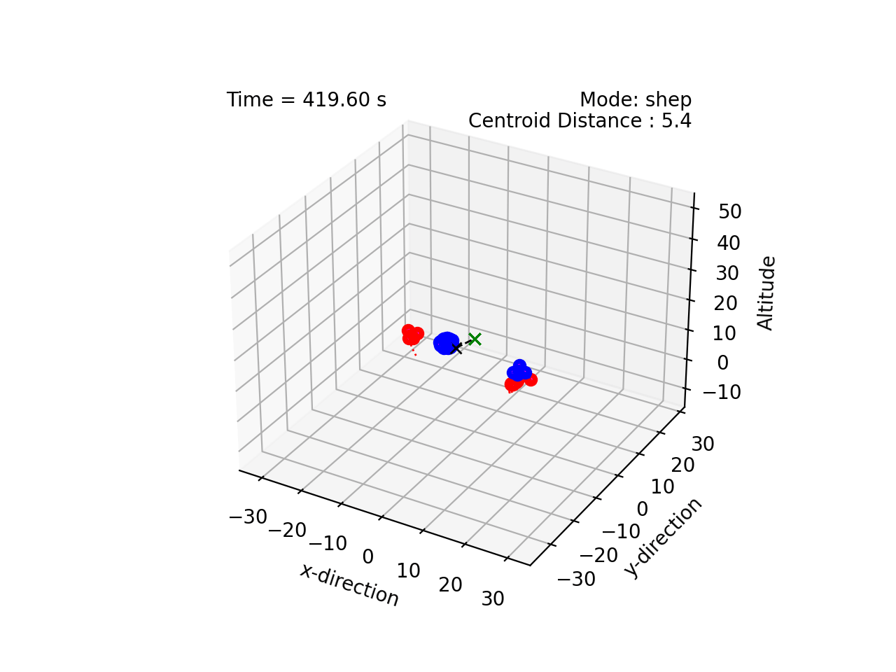

# Shepherding 

This project implements shepherding for a group of dynamic agents. 
We extend the work in [van Havermaet (2023)](https://royalsocietypublishing.org/doi/10.1098/rsos.230015) to 3D and
incorporate the collision avoidance technique in [Olfati-Saber (2006)](https://ieeexplore.ieee.org/document/1605401) to maintain separation between shepherds.

## Demonstrations

Shepherding using van Havermaet technique with Olfati-Saber obstacle avoidance:


    



    
    


Here is a really big swarm


    


## Citing

The code is opensource but, if you reference this work in your own reserach, please cite me. I have provided an example bibtex citation below:

`@techreport{Jardine-2023,
  title={Shepherding via Pinning Control},
  author={Jardine, P.T.},
  year={2023},
  institution={Royal Military College of Canada, Kingston, Ontario},
  type={GitHub Repository}
}`

Alternatively, you can cite any of my related papers, which are listed in [Google Scholar](https://scholar.google.com/citations?hl=en&user=RGlv4ZUAAAAJ&view_op=list_works&sortby=pubdate).















 

