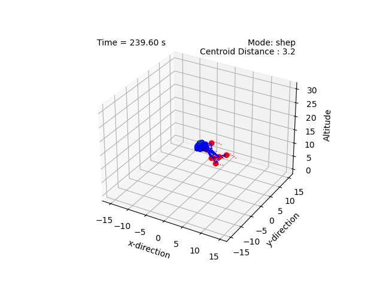
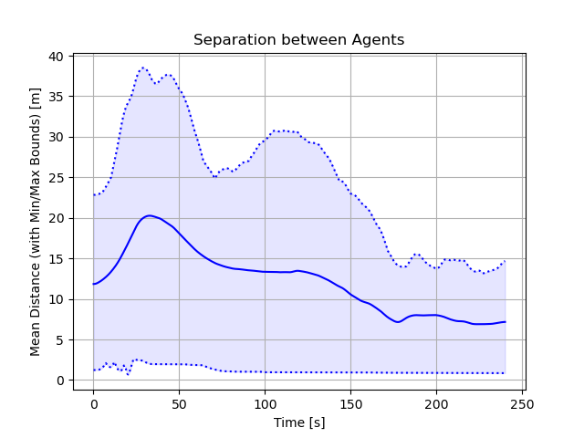

# Shepherding via Pinning Control

This project implements shepherding for a group of dynamic agents. 
We extend the work in [van Havermaet (2023)](https://royalsocietypublishing.org/doi/10.1098/rsos.230015) to 3D and
incorporate the collision avoidance technique in [Olfati-Saber (2006)](https://ieeexplore.ieee.org/document/1605401) to maintain separation between shepherds.
We compare the behaviour to shepherding via pinning control. 

Note:

This project includes significant improvements that will form the basis of the next iteration of [multi-agent_sim](https://github.com/tjards/multi-agent_sim) .

## Demonstrations

Shepherding using van Havermaet technique:


    
    



    
        


Shepherding using pinning control (pins selected to maximize degree centrality per graph component):


     



     
     


## Citing

The code is opensource but, if you reference this work in your own reserach, please cite me. I have provided an example bibtex citation below:

`@techreport{Jardine-2023,
  title={Shepherding via Pinning Control},
  author={Jardine, P.T.},
  year={2023},
  institution={Royal Military College of Canada, Kingston, Ontario},
  type={GitHub Repository}
}`

Alternatively, you can cite any of my related papers, which are listed in [Google Scholar](https://scholar.google.com/citations?hl=en&user=RGlv4ZUAAAAJ&view_op=list_works&sortby=pubdate).















 

